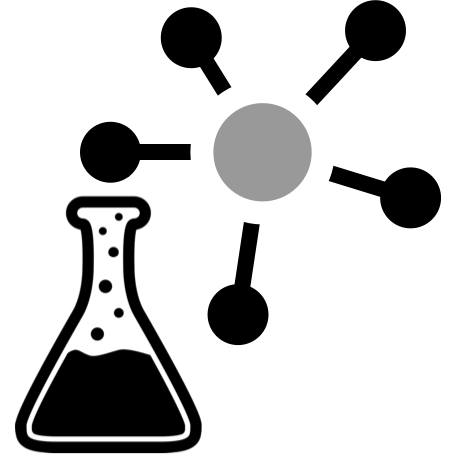

# Graph Data Science

The **kglab** package provides a simple
[abstraction layer](glossary/#abstraction-layer)
in Python for building
[*knowledge graphs*](glossary/#knowledge-graph).

The main goal is to leverage idiomatic Python for common use cases in 
[data science](glossary/#data-science)
and 
[data engineering](glossary/#data-engineering)
work that require graph data, presenting 
[*graph data science*](glossary/#graph-data-science)
as an emerging practice.

## Cut to the Chase

  1. To get started right away, jump to [*Getting Started*](start/)
  1. For other help, see [*Community Resources*](community/)
  1. For an extensive, hands-on coding tour through **kglab**, follow the [*Tutorial*](tutorial/) notebooks
  1. Check the source code at <https://github.com/DerwenAI/kglab>

## Motivations

!!! note
    **FAQ:** Why build yet another graph library, when there are already so many available?

A short list of primary motivations have been identified for
**kglab**, its design criteria, and engineering trade-offs:

### Popular Graph Libraries

**Point 1:**
integrate with popular graph libraries, including 
[RDFlib](https://rdflib.readthedocs.io/),
[OWL-RL](https://owl-rl.readthedocs.io/),
[pySHACL](https://github.com/RDFLib/pySHACL),
[NetworkX](https://networkx.org/),
[iGraph](https://igraph.org/python/),
[PyVis](https://pyvis.readthedocs.io/), 
[node2vec](http://snap.stanford.edu/node2vec/),
[pslpython](https://psl.linqs.org/),
[pgmpy](https://pgmpy.org/),
and so on –
several of which would otherwise not have much common ground.

### Data Science Workflows

**Point 2:**
close integration plus example code for working with the
["PyData" stack](https://numfocus.org/sponsored-projects),
namely
[pandas](https://pandas.pydata.org/),
[NumPy](https://numpy.org/),
[scikit-learn](https://scikit-learn.org/),
[matplotlib](https://matplotlib.org/),
etc.,
as well as
[PyTorch](https://pytorch.org/),
and other quintessential data science tools.

### Distributed Systems Infrastructure

**Point 3:**
integrate efficiently with *Big Data* tools and practices for contemporary
[data engineering](glossary/#data-engineering)
and
[cloud computing](glossary/#cloud-computing)
infrastructure, including:
[Ray](https://ray.io/),
[Jupyter](https://jupyter.org/),
[RAPIDS](https://rapids.ai/),
[Apache Arrow](https://arrow.apache.org/),
[Apache Parquet](https://parquet.apache.org/),
[Apache Spark](https://spark.apache.org/),
etc.

### Natural Language Understanding

**Point 4:**
incorporate graph data science practices and
[semantic technologies](glossary/#semantic-technologies)
into
[`spaCy`](https://spacy.io/) pipelines, e.g., through 
[`pytextrank`](https://github.com/DerwenAI/pytextrank/), 
plus
[`Rubrix.ml`](https://rubrix.ml/)
and other customized
[natural language](glossary/#natural-language)
pipelines.

### Hybrid AI Approaches

**Point 5:**
explore "hybrid" approaches that combine 
[machine learning](glossary/#machine-learning)
with
symbolic, rule-based processing – including 
[probabilistic graph inference](glossary/#probabilistic-graph-inference)
and
[knowledge graph embedding](glossary/#knowledge-graph-embedding).
